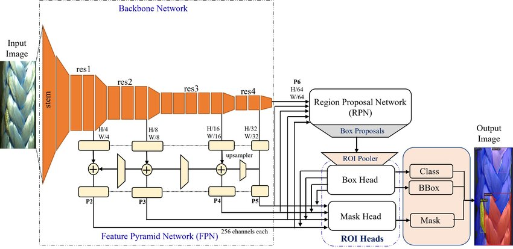

# Detectron2 Model for Panoptic Segmentation

This project performs panoptic segmentation using Detectron2 (FPN). We are using a model with ResNet101 and FPN (Ref: [Detectron2 Model Zoo](https://github.com/facebookresearch/detectron2/blob/main/MODEL_ZOO.md#coco-panoptic-segmentation-baselines-with-panoptic-fpn)). The model is trained on COCO instance segmentation data.

**Backbone Network:** This part of the model extracts feature maps from the input image at different scales. The output features of FPN are indexed corresponding to their scale as P2 (1/2), P3 (1/4), P4 (1/8), P5 (1/16), and P6 (1/32).

**Region Proposal Network:** This part of the model generates object proposals from the feature maps. The proposals are generated at different scales corresponding to the feature maps along with confidence scores.

**Box Head:** This part of the model predicts the bounding box coordinates for each proposal.

**Mask Head:** This part of the model predicts the instance segmentation mask for each proposal.

